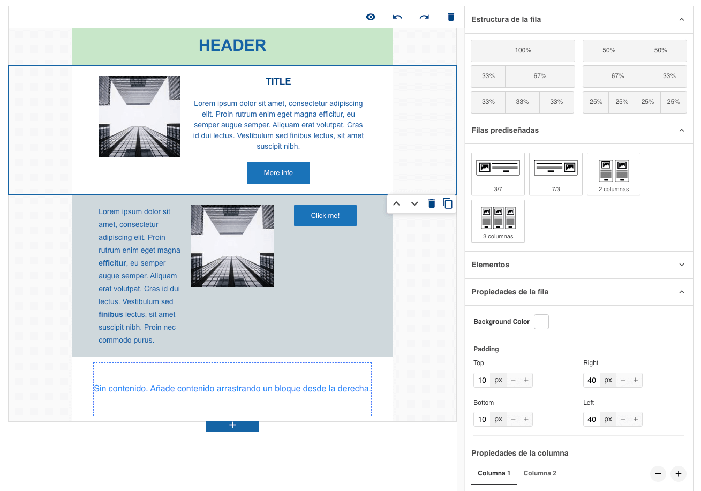
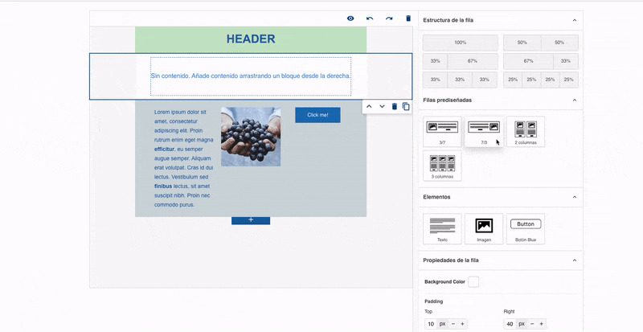
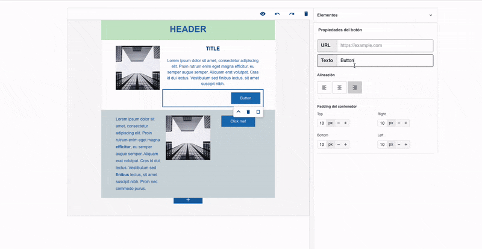
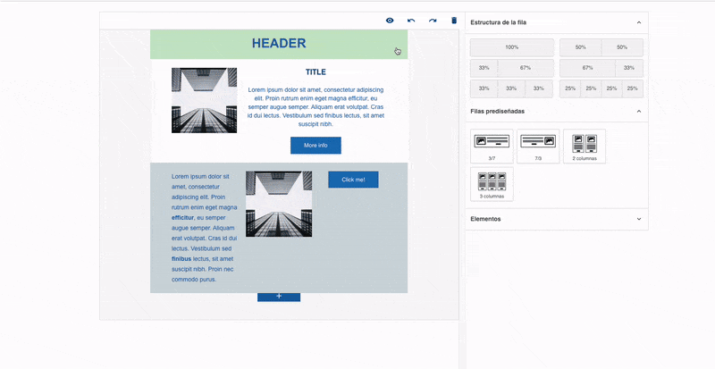

# Project Title

Custom email editor.

## About the Project

This project is a **customizable email editor** built with Vue.js and MJML, designed to simplify the process of creating responsive email templates. It combines a drag-and-drop interface with modular components, allowing users to design emails without requiring extensive coding knowledge.

The editor is part of a larger **professional project** developed for a specific use case. Due to confidentiality, this repository showcases only a **simplified version** of the editor.

## Technologies Used

- [Vue 3](https://vuejs.org/)
- [MJML](https://mjml.io/)
- [CKEditor](https://ckeditor.com/)
- [Vite](https://vitejs.dev/)

## Demo

Here are some examples of how the editor works:

### 1. Main Interface
The main layout of the editor.

### 2. Drag-and-Drop Functionality
Add predefined rows to the canvas.

### 3. Customize blocks
Change each block easily.

### 4. See How the Email Looks
Preview how the email will appear on desktop and mobile devices

